# Spice Cloud 🍲 - Cloud Kitchen Project

**Spice Cloud** is a college semester project for a **Cloud Kitchen System** built using **MVC .NET Core**. It features user-friendly online food ordering, chef management, admin controls, and **Razorpay payment integration**.  

---

## Project Modules & Features

### 1. User Module
- Register and login  
- Browse dishes  
- Add dishes to cart  
- View cart and modify items  
- Place orders  
- Make payments via Razorpay  
- View order history  
- Logout  

### 2. Admin Module
- Login  
- View all users, chefs, and orders  
- Manage orders (pending/complete)  
- View payment details  
- Logout  

### 3. Chef Module
- Register and login  
- Add new dishes  
- Update existing dishes  
- View pending and completed orders  
- Update order status  
- Check payment confirmation  
- Logout  

---

## Technologies & Libraries
- **Framework:** ASP.NET Core MVC  
- **Database:** Microsoft SQL Server Express (Code First Approach)  
- **ORM:** Entity Framework Core  
- **Frontend:** Razor Views, HTML, CSS, JavaScript, Bootstrap  
- **Payment Gateway:** Razorpay  
- **Other Libraries / NuGet Packages:**  
  - Microsoft.EntityFrameworkCore  
  - Microsoft.EntityFrameworkCore.SqlServer  
  - Microsoft.EntityFrameworkCore.Tools  
  - Microsoft.AspNetCore.Identity.EntityFrameworkCore  
  - Microsoft.AspNetCore.Authentication  
  - Newtonsoft.Json (for Razorpay integration)  

---

## Razorpay Integration
1. **Create a Razorpay Account**: [Razorpay](https://razorpay.com/)  
2. **Get API Keys**:  
   - Use **Test Key ID** and **Test Key Secret** for development  
 <!--  - Use **Live Key ID** and **Live Key Secret** after KYC verification  -->

3. **Add API Keys to Project**:  
   Add them in `appsettings.json` or environment variables:  
   ```json
   "Razorpay": {
       "KeyId": "your_test_key_id",
       "KeySecret": "your_test_key_secret"
   }


4. Switch to Live Mode once verified by Razorpay.

---

## Installation & Setup

1. **Clone the repository:**

```bash
git clone https://github.com/sujitkargal/Cloud-Kitchen-Project.git
cd spice-cloud
```

2. **Update Connection String in `appsettings.json`:**

```json
"ConnectionStrings": {
    "DefaultConnection": "Server=YOUR_SERVER_NAME;Database=SpiceCloudDB;Trusted_Connection=True;MultipleActiveResultSets=true"
}
```

3. **Apply Migrations (Code First Approach):**

```bash
dotnet ef migrations add InitialCreate
dotnet ef database update
```

*Or using Visual Studio Package Manager Console:*

```bash
Add-Migration InitialCreate
Update-Database
```

4. **Run the application:**

```bash
dotnet run
```

---

## Project Status

* ✅ Fully functional with Razorpay Test Mode
* ⚠ Live payments require Razorpay account verification

---

* ## Author
- Name: Sujit Kargal

---

## 🤝 Contribute

Contributions are welcome!

If you want to improve Spice Cloud, fix bugs, or add new features:

### ✔ How to Contribute

1. **Fork** the repository  
2. **Create a branch**  
   ```bash
   git checkout -b feature-name

3. **Commit your changes**
   ```bash
   git commit -m "Add: your update"
   
4. **Push the branch
   ```bash
   git push origin feature-name

5. Open a Pull Request
  - Have feature ideas?
---
## **Output Sample**
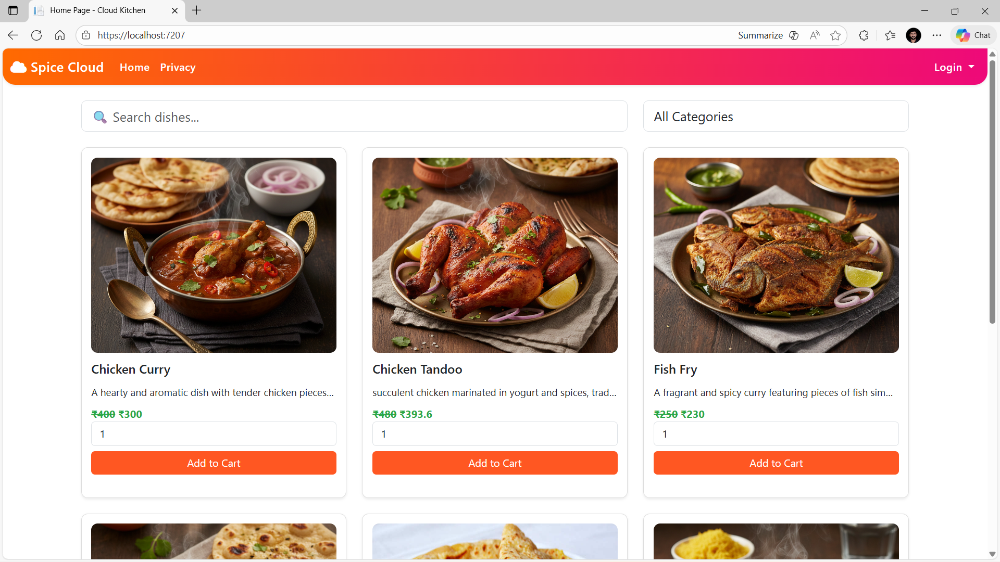
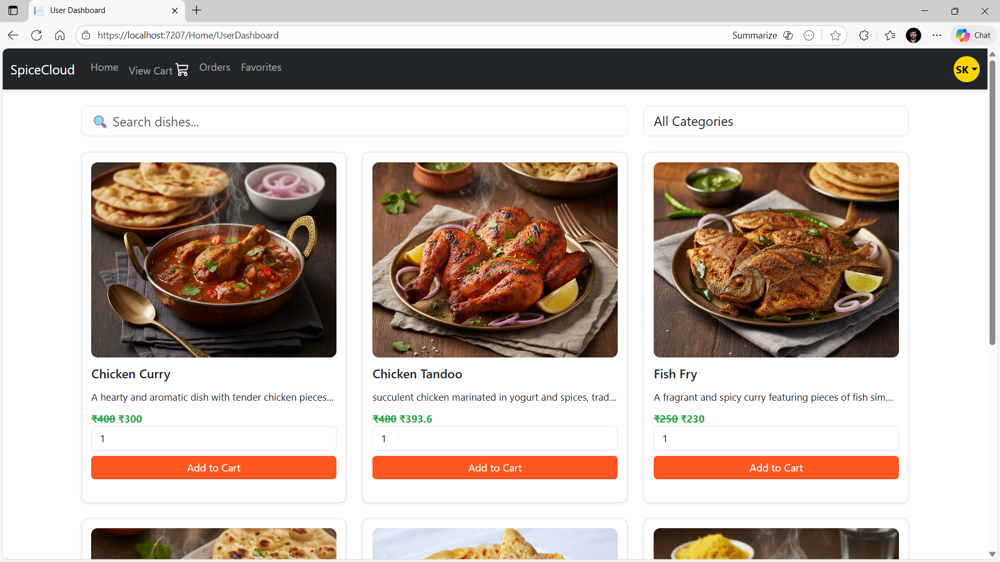
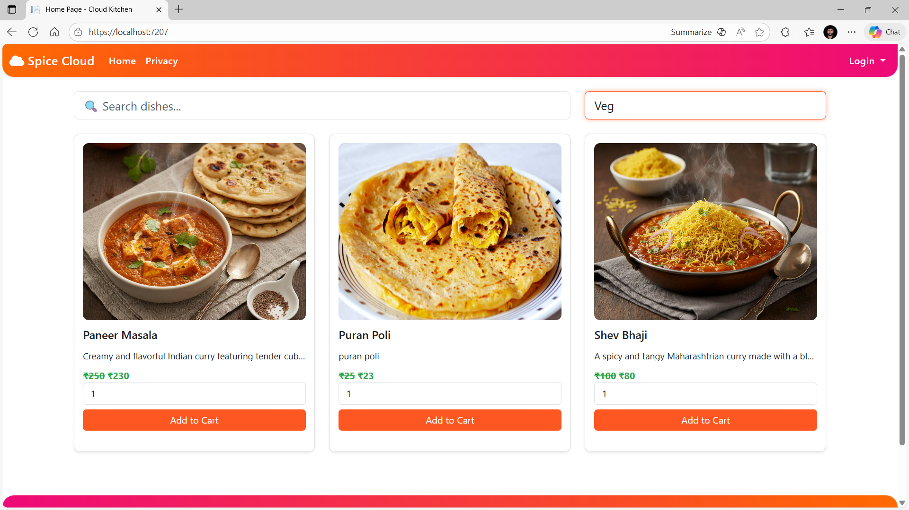
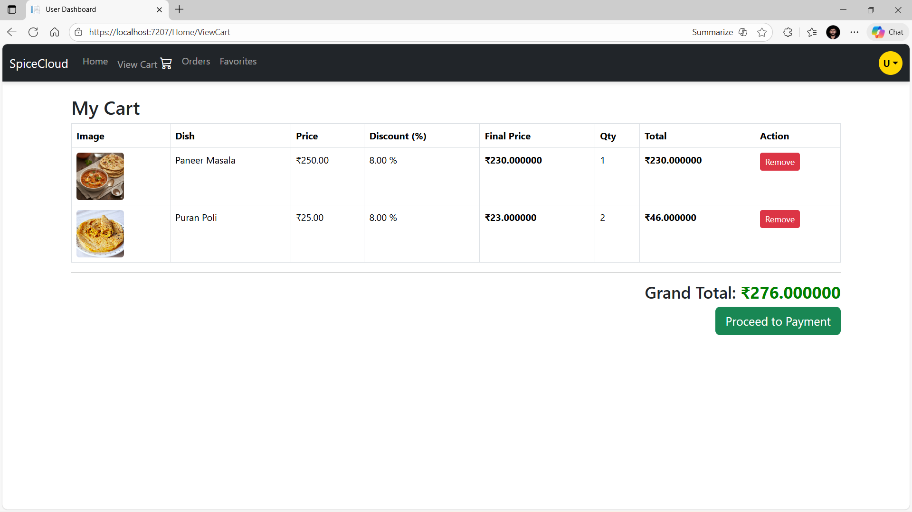
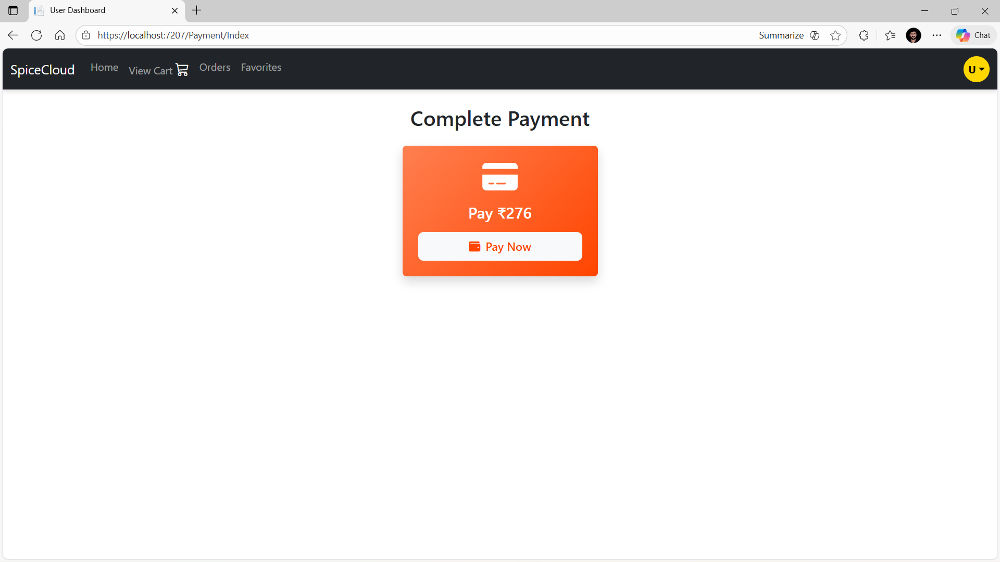
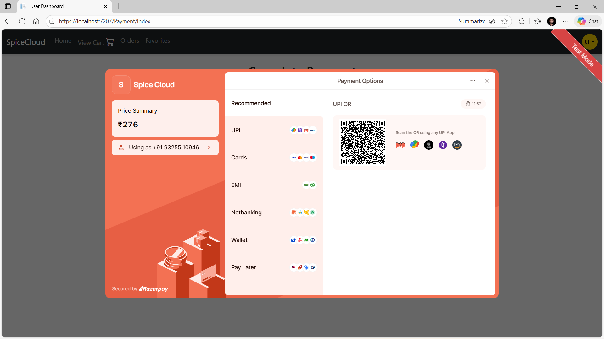
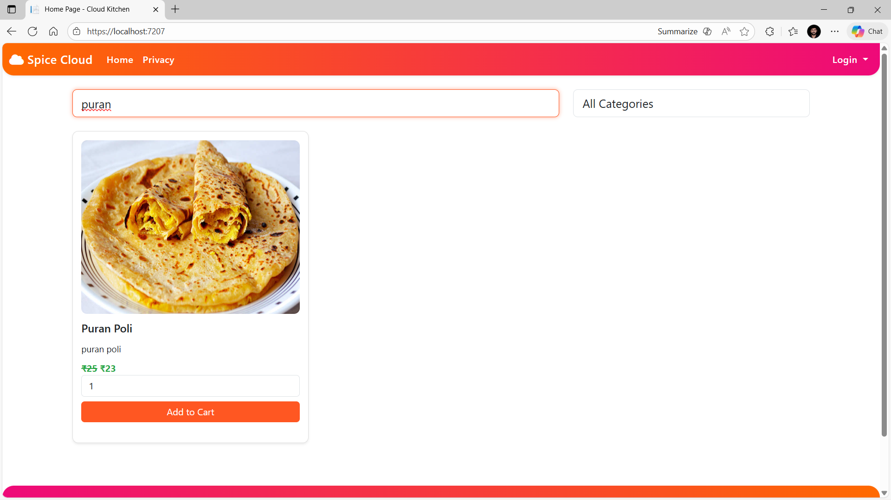
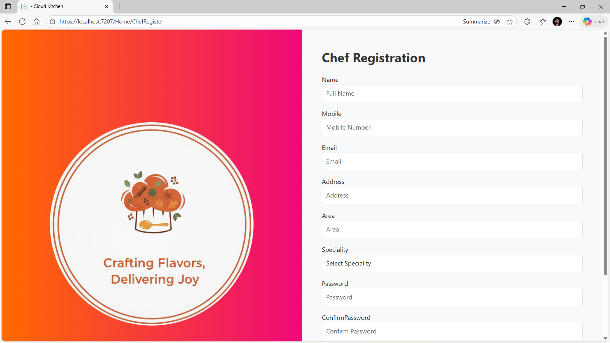
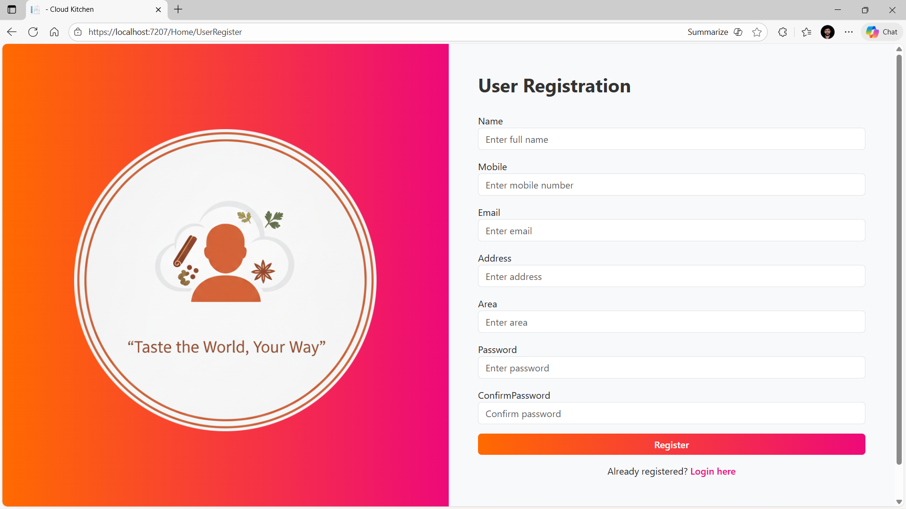
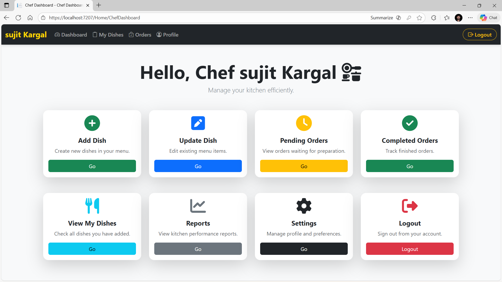
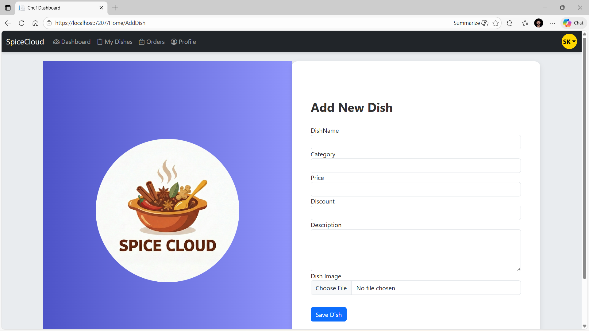
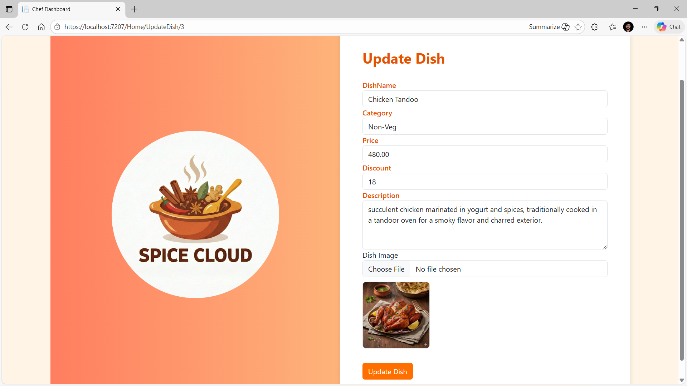

---

   

   


